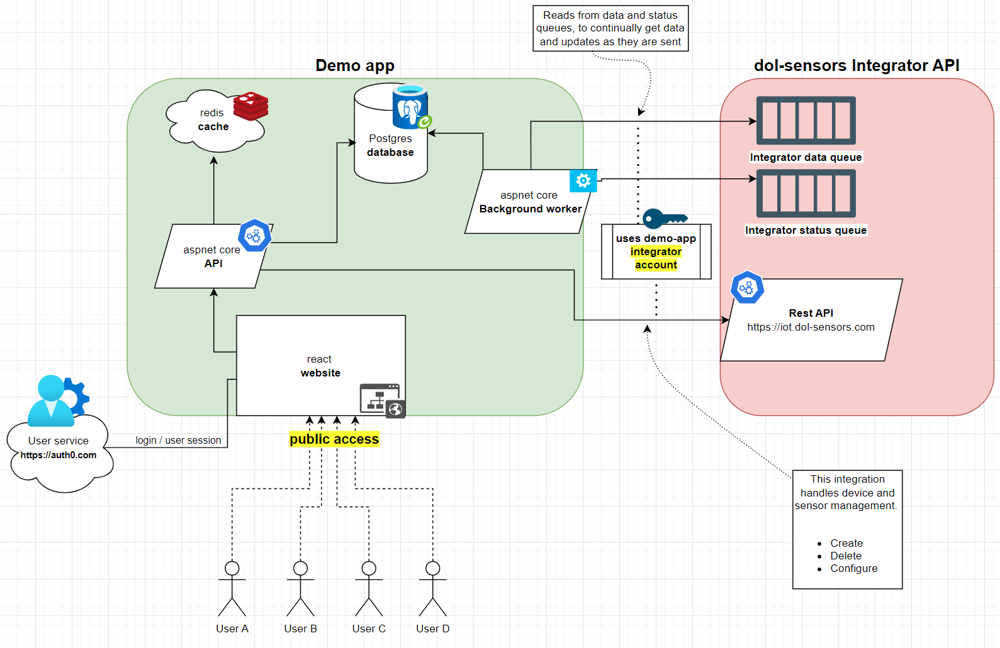
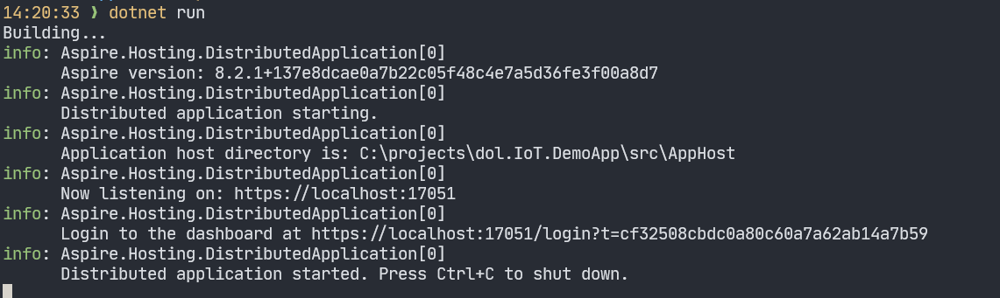
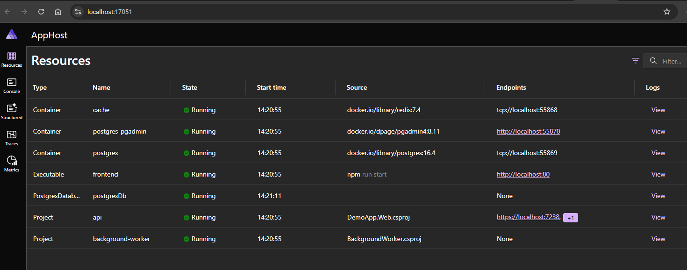
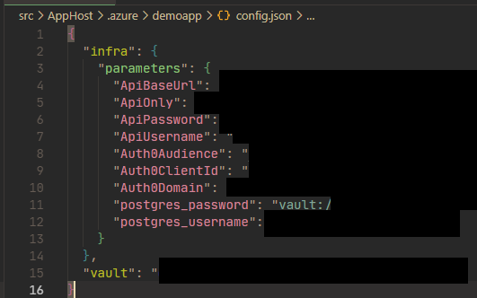

# dol-sensors demo app

This project is an example of an integration to the [dol-sensors integrator api](https://iot.dol-sensors.com/)

By creating a user with this app you can easily configure devices and sensors that dol-sensors produces. It also allows easy access to the data collected by the configured sensors and devices.  
The website is optimized for mobile use (easy read qr-codes on sensors), but can also be used on tablet and laptop.

This app contains a few different services, the most notable are a database (postgres), a http api (aspnetcore / C#) and a frontend website (react / javascript).

## Users vs integrator account
The app can do all these things by using an `dol-sensors integrator account`. For your own use cases and integration into your own systems, you will need an integrator account created for your company.

The users in this app is only something this app uses and are aware off. The dol-sensors integrator api does not know or care about end users, it deals only with integrators (i.e. your company's, or this app's). 

# Technical stuff


This project uses [aspire](https://learn.microsoft.com/en-us/dotnet/aspire/get-started/aspire-overview) to orchestrate the different smaller services and wire them together.

## Component overview


The main components in this app are

- `Website` - the UI where users can interact with the system 
- `Api` - the backend used by the frontend. This handles all communication with the dol-sensors integrator api
- `Background worker` - a simple background worker that consumes data and status messages from integrator api queues, as well as running cronjobs. 
- `Database` - a postgres database. In development this is a docker container, in production it is an azure PostgreSQL flexible server.
- `Cache` - a container running redis.  
- `Aspire app host` - A development only component, orchestrates and wires the other components together.

In addition to those, there is also a couple of required external systems

- **`dol-sensors integrator api`** - allows the app to configure sensors and receive data. This whole app serves as an example of integrating this api.
- `Auth0` - used to handle user management, authentication and authorization  

### Aspire app host

An aspire app that wires the other components together in a simple fashion. See src/AppHost.

### Website

Node + react app. Found in the src/frontend folder.

### Api 

An aspnet core application, found in the `src/DemoApp.Web` folder. 
The different endpoints are found in the `api/Endpoints` folder.  
In there you can see examples of how to use the integrator api is being used.

Note that the actual calls to the integrator api are done in the `IntegratorApiClient.cs` class found in the `src/DemoApp.Core/IntegratorApi` folder.

The authentication to the integrator api is done with the login handler found in the `src/DemoApp.Core/IntegratorApi/LoginHandler.cs` file.  
This makes sure to get an access token from the integrator api and add it to the request header (and refreshes the token if it expires).

### Background worker

An aspnet core application, found in the `src/BackgroundWorker` folder. 
Especially the `QueueConsumer.cs` class is of interest here. There you can see an example of how this app consumes data and status messages from the integrator api queues using the ServiceBusProcessor.
For a different approach in consuming messages from a service bus see `DeadLetterConsumer`, that uses the ServiceBusReceiver instead of the processor. 

## Running this project

You will need 
- [dotnet 9 sdk](https://dotnet.microsoft.com/en-us/download)
- [docker](https://www.docker.com/)
- [node v20](https://nodejs.org/en/download/package-manager/current) 
- [yarn](https://www.npmjs.com/package/yarn)

when you have all this installed, start by getting the frontend packages downloaded. 
Open a terminal and go to folder src/frontend and execute `yarn install`.

This projects uses Aspire to orchestrate the services during development. 
To run the whole stack, execute command `dotnet run` in the src/AppHost folder, which will start up all the services. Before that, you will need to setup some configuration.

### Database migrations
Use ef core to generate a new database migration if you want to change the database schema  
Example command to run from CLI in root folder

`dotnet ef migrations add SomeNewMigrationName -p .\src\BackgroundWorker -s .\src\BackgroundWorker -c DemoAppDbContext`

The migrations will be run automatically by the BackgroundWorker

### Config 

#### dol-sensors Integrator API

The app can interact with the dol-sensors integrator api, by using the demo-apps integrator account.
This is done via the `ApiUsername` and `ApiPassword` config values.  
Store these in the user secrets in the different projects.

in src/AppHost they should be in section Parameters instead so run
- `dotnet user-secrets set Parameters:ApiUsername "......""`
- `dotnet user-secrets set Parameters:ApiPassword "......""`

When running the api and background worker via running the aspire app host project, the previous values are injected into the environment variables for the different services to use.

To run the two dotnet projects individually, go to folders (src/BackgroundWorker and src/DemoApp.Web) and add the api username and password.
- `dotnet user-secrets set Api:Username "......""`
- `dotnet user-secrets set Api:Password "......""`

#### Auth0

The app uses Auth0 for user management, authentication and authorization. 
In order to run this app locally you can use the auth0 application settings provided in the demo app. This will only work when the frontend is running on `localhost:80` so you cannot use it in production.
This will also allow you to reuse the user account you created in the live demo app.

The following values are needed in the config
- Auth0Domain - points to the auth0 tenant
- Auth0ClientId - an id of a created application in auth0 (corresponds to the frontend in this demo app).
- Auth0Audience - the audience of the backend api application created in auth0 (corresponds to the backend api in this demo app).

If you want to reuse this project and host your own version, you will need to create your own Auth0 tenant and application.

#### Running the app

When you have your own integrator account configured and have your own application in Auth0 you can finally run the app.  

Make sure docker is running on your pc.  
After that go to the folder src/AppHost and execute `dotnet run`. This should show you something like this



Opening the localhost link will show you the aspire dashboard, where you can see all the different services running



#### Http requests

In the folder http-requests/ you can find a list of all the different backend-api endpoints. You can download the program bruno https://www.usebruno.com/
and use that to try sending requests to the different endpoints. Simply select 'open collection' and point it to the http-requests folder.
In the top right corner you can select an environment. Here you can create your own and populate the environment with some variables the different endpoints use like 
- baseUrl
- macAddress
- key
- devEui
- bearerToken

## Hosting, deployment, CI/CD
Uses the azure developer cli tool (azd), since it has some integrations to aspire.

https://learn.microsoft.com/en-us/azure/developer/azure-developer-cli/install-azd

The solution is deployed in Azure Container Apps, where each of the components are hosted as an individual app inside the Container Apps Environment.

### Create IoC files
In src/AppHost folder

`azd init`

You need to provide it with an environment name, in this example 'demoapp' is used
This will create the initial stuff that azd needs, namely a .azure folder. Inside that folder is the environment name along with an .env file.

`azd infra synth`

This creates a new folder 'infra' container the bicep files that can create the necessary services in azure. 

### setup deployment script
In root folder.

`azd pipeline config --environment demoapp --provider github --remote-name github  -C .\src\AppHost`

the environment flag should match what you created with azd init. The remote name is normally origin, but in this example it is called github. 

This will create a new github actions file .github/workflows/azure-dev.yml. In addition it will create a service principal inside azure that allows github to create and change the resources. 
It will also create a number of variables in github actions needed for the azure deployments, and finally, the .azure/demoapp/config.json file's parameters are set in github as a secret.  
That json file contains the given parameters needed for the services to run. Some of these parameters are "ApiBaseUrl", "ApiOnly" ,"postgres_username", and a few more. 

Some of these parameters are auto generated by the bicep files, others you will need to provide during the `azd pipeline config` command. 

Example of config.json file found in the `.azure/demoapp` folder 


The values from src\AppHost\.azure\{envname}\config.json will be pushed into github action secrets and used in the pipeline step azd provision in the section 

```
env: 
    AZD_INITIAL_ENVIRONMENT_CONFIG: ${{ secrets.AZD_INITIAL_ENVIRONMENT_CONFIG }}
```